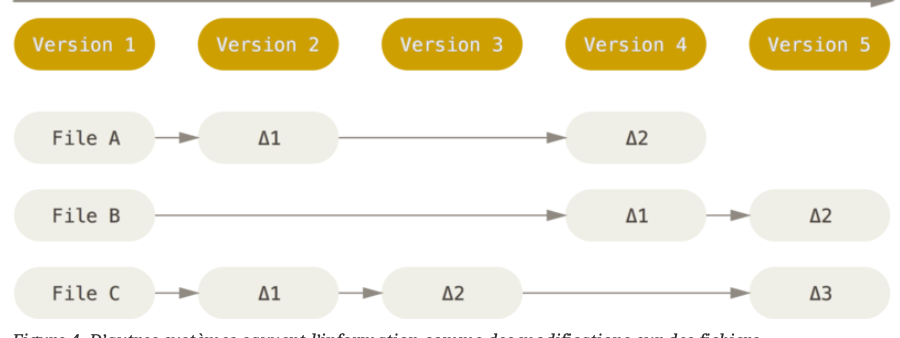
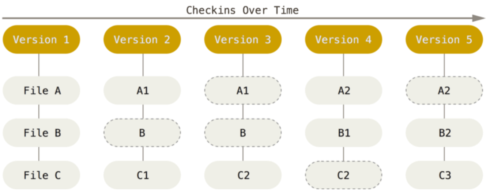
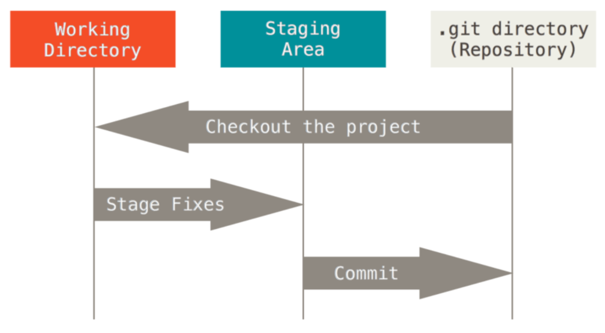
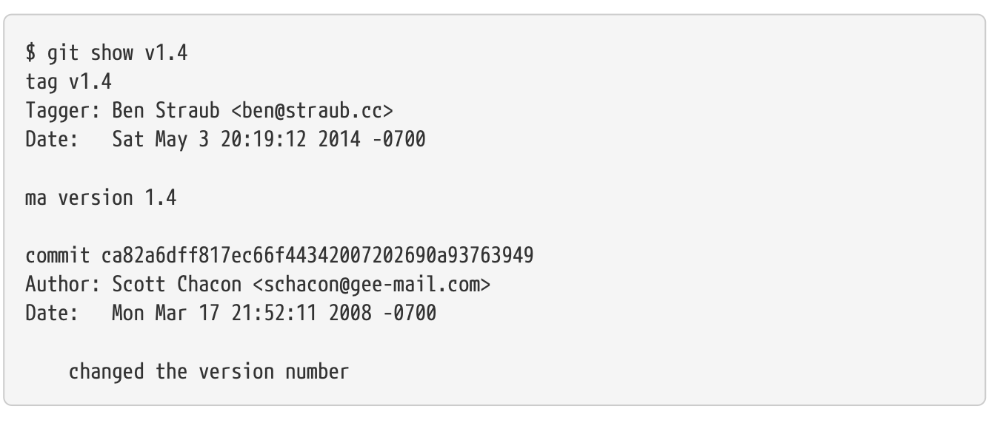

# Maitrise du versioning avec Git

## Introduction au versioning

Le versioning, ou gestion de versions, est un élément crucial dans le développement de logiciels car il permet de suivre et de gérer les changements apportés au code source au fil du temps. Cela implique d'enregistrer des modifications dans un dépôt central à l'aide d'un système de contrôle de version, tel que Git ou Subversion (SVN), permettant aux développeurs de collaborer sur des projets sans risquer de conflits de code ou de perte d'informations.

**Définition et Objectifs du Versioning :**
La gestion de versions consiste à garder une trace de chaque modification apportée au code dans un type de base de données. Pour chaque modification, le système de contrôle de versions enregistre qui a fait le changement, pourquoi il a été fait, et les détails spécifiques de la modification. Cela permet aux développeurs :

- De revenir à des versions antérieures si une nouvelle version cause des problèmes.
- De comparer les changements au fil du temps.
- De déterminer qui a apporté une modification spécifique en cas de problème.
- De travailler en parallèle sur différentes fonctionnalités sans perturber le travail des autres.

**Importance du Versioning :**

- **Traçabilité :** Chaque changement est enregistré avec un identifiant unique, souvent accompagné d'un message descriptif, ce qui facilite la compréhension de l'historique du projet.
- **Collaboration :** Dans des équipes de développement, plusieurs personnes peuvent travailler sur le même code source en même temps. Le versioning aide à synchroniser le travail de tout le monde, à résoudre les conflits et à intégrer les contributions de manière contrôlée.
- **Backup et Rétablissement :** En cas de perte de données ou de bugs, il est possible de restaurer n'importe quelle version antérieure du projet.
- **Branching et Merging :** Les développeurs peuvent créer des branches pour travailler sur des fonctionnalités ou des corrections séparément (branching), puis intégrer ces changements dans la ligne principale de développement (merging).

**Exemples de Nomenclature de Versioning :**
La nomenclature de versioning varie selon les organisations et les projets, mais il existe des conventions communes. Une des plus courantes est le versionnage sémantique, ou SemVer, qui utilise un format de type `MAJEURE.MINEURE.CORRECTIF`:

- **MAJEURE** : Indique une version qui fait des changements incompatibles avec les versions antérieures.
- **MINEURE** : Indique l'ajout de nouvelles fonctionnalités de manière rétrocompatible.
- **CORRECTIF** : Indique des corrections de bugs rétrocompatibles.

Un exemple de version pourrait être `2.3.1` où :

- `2` est le numéro de version majeur.
- `3` est le numéro de version mineur.
- `1` est le numéro de version de correctif.

En plus de ces numéros, des métadonnées supplément

aires peuvent être ajoutées pour plus de détails, comme :

- **alpha** ou **beta** : pour des versions en cours de développement, par exemple `2.3.1-alpha.1` ou `2.3.1-beta.2`.
- **snapshot** : souvent utilisé dans les environnements Java pour indiquer une version en cours, par exemple `2.3.1-SNAPSHOT`.
- **build** ou **revision** : identifiants de construction ou de révision, souvent automatiquement générés, par exemple `2.3.1.456` où `456` peut être un numéro de build ou de commit.

**Nomenclature basée sur la date :**
Certains projets utilisent des dates pour la version, ce qui peut indiquer quand une version a été publiée. Par exemple :

- `2023.01` pour une version de janvier 2023.
- `20230415` pour une version publiée le 15 avril 2023.

**Nomenclature basée sur les fonctionnalités :**
Dans certains cas, les versions peuvent être nommées en fonction des fonctionnalités majeures introduites. Par exemple, si une version introduit une grande amélioration de performance, elle pourrait être appelée `2.3.1-speedup`.

**Git Tags pour le Versioning :**
Dans Git, les étiquettes (tags) sont souvent utilisées pour marquer les points de version dans l'historique des commits. Par exemple, après avoir fusionné une nouvelle fonctionnalité dans la branche principale, vous pouvez exécuter une commande comme `git tag -a v2.4.0 -m "Ajout de fonctionnalité X"` pour marquer cette version.

**Exemple de Cycle de Vie d'une Version :**
Voici un exemple hypothétique du cycle de vie d'une version dans un projet logiciel :

1. Début du développement de la version `2.3.0`.
2. Les nouvelles fonctionnalités sont développées et des versions alpha sont publiées pour les tests internes, comme `2.3.0-alpha.1`.
3. Après les tests et les corrections, la version entre en phase beta, `2.3.0-beta.1`.
4. D'autres tests sont effectués, des problèmes sont corrigés, et peut-être une autre version beta est publiée, `2.3.0-beta.2`.
5. Une fois que tout est stable, la version `2.3.0` est officiellement publiée.
6. Des bugs sont découverts après la sortie, donc des versions correctives sont publiées, commençant par `2.3.1`, puis `2.3.2`, etc.

Chaque étape de ce processus est documentée et versionnée, ce qui fournit une transparence et un contrôle indispensables pour une gestion efficace du projet de développement logiciel.

## Aperçu des Systèmes de Versioning

Il existe de nombreux systèmes de contrôle de version, mais les deux principaux sont Git et Subversion (SVN). Ils ont des approches différentes pour gérer les versions, et chacun a ses avantages et ses inconvénients.

Subversion (SVN) et Git sont deux des systèmes de gestion de versions les plus populaires dans le développement de logiciels. Voici un aperçu des deux, en commençant par SVN :

**Subversion (SVN) :**

**Histoire et Concept :**
SVN, également connu sous le nom d'Apache Subversion, est un système de contrôle de version centralisé créé en 2000. Il a été conçu pour remplacer CVS (Concurrent Versions System), en corrigeant ses défauts tout en conservant un modèle similaire.

**Modèle Centralisé :**
Dans SVN, il existe un référentiel central unique où toutes les versions des fichiers sont stockées. Les développeurs vont "checkout" une copie de travail du dépôt, faire leurs modifications, et ensuite "commit" leurs changements dans ce dépôt central. Ce modèle centralisé signifie que les utilisateurs doivent être connectés au réseau pour soumettre des modifications, et que la perte du serveur central sans sauvegarde appropriée peut entraîner la perte de l'historique du projet.

**Opérations et Fonctionnalités :**

- **Checkout/Update/Commit** : Les opérations de base permettent de récupérer le code, de mettre à jour la copie de travail et d'envoyer des modifications.
- **Branching et Merging** : SVN gère les branches et les fusions, mais ces opérations sont souvent considérées comme plus complexes et plus lourdes que dans Git.
- **Atomic Commits** : Les commits dans SVN sont atomiques, signifiant que soit toutes les modifications d'un commit sont appliquées, soit aucune, ce qui garantit l'intégrité du dépôt.

**Sécurité et Permissions :**
SVN permet une gestion fine des permissions d'accès au niveau des fichiers et des répertoires dans le dépôt.

**Git :**

**Histoire et Concept :**
Git est un système de contrôle de version distribué créé par Linus Torvalds en 2005 pour le développement du noyau Linux. Il a été conçu pour être rapide, efficace avec des projets de grande taille, et pour supporter le développement non linéaire avec des milliers de branches parallèles.

**Modèle Distribué :**
Contrairement à SVN, Git est distribué, signifiant que chaque développeur a une copie complète du dépôt avec tout l'historique des versions. Cela permet aux développeurs de travailler localement et de committer des changements sans avoir besoin d'une connexion au dépôt central, et de synchroniser leurs modifications avec le dépôt central quand cela leur convient.

**Opérations et Fonctionnalités :**

- **Branching et Merging** : Les opérations de branchement et de fusion sont plus simples et plus rapides, grâce à la nature distribuée de Git.
- **Staging Area** : Git introduit la notion de "staging area" ou "index", qui permet de préparer et de réviser les modifications avant de les commettre.
- **Flexibilité** : Git supporte de nombreux workflows, tels que Git Flow et Forking, qui sont bien adaptés à divers styles de développement.

**Performance :**
Git est conçu pour être très performant, avec des opérations rapides sur l'historique des versions et sur les branches, même dans les grands projets.

**Réseau et Collaboration :**
La nature distribuée de Git le rend idéal pour les modèles de collaboration modernes, en particulier avec l'émergence de plateformes telles que GitHub, GitLab et Bitbucket qui facilitent la revue de code, les pull requests et l'intégration continue/le déploiement continu (CI/CD).

**Conclusion :**
SVN peut toujours être le choix préféré pour certains projets, en particulier ceux qui nécessitent un contrôle d'accès fin et où le modèle centralisé est une approche adaptée. Cependant, Git est devenu le système de gestion de versions standard pour la plupart des développeurs, en raison de sa flexibilité, de sa performance et de son support pour les workflows distribués et collaboratifs.

### Git en details

La principale difference entre Git et d'autres SCMs, reside dans la façon dont Git considere les données.

Conceptuellement, la plupart des autres SCMs stockent les informations sous la forme d'une liste de modifications apportées à chaque fichier au fil du temps.



Alors que Git considère les données comme un ensemble de snapshots d'un mini système de fichiers. Chaque fois que vous validez un changement, ou que vous enregistrez l'état de votre projet dans Git, il prend une photo de ce que tous vos fichiers ressemblent à ce moment-là et stocke une référence à cette copie instantanée. Pour être efficace, si les fichiers n'ont pas changé, Git ne stocke pas le fichier à nouveau, mais un lien vers le fichier identique précédemment stocké. Git considère ses données plus comme un ensemble de mini-systèmes de fichiers.



#### Avec Git la quasi-totalité des opérations sont locales

#### Git se charge de gerer l'intégrité des données

Avant la plupart des operations effectuees avec Git, Git effectue une "somme de controle", et obtient une signature unique qui sert de reference. On peut ainsi verifier l'integrite des donnees. Cela signifie qu'il est impossible de modifier le contenu d'un fichier sans que Git ne le sache.

Le mecanisme utilise par Git est appele un empreinte SHA-1. Une chaine de caracteres composees de 40 caracteres hexadecimaux qui ressemble a cela :

```sh
24b9da6552252987aa493b52f8696cd6d3b00373
```

#### Avec Git très peu d'opérations sont destructives

Quand vous réalisez des actions dans Git, la quasi-totalité d’entre elles ne font qu’ajouter des données dans la base de données de Git. Il est très difficile de faire réaliser au système des actions qui ne soient pas réversibles ou de lui faire effacer des données d’une quelconque manière. Par contre, comme dans la plupart des systèmes de gestion de version, vous pouvez perdre ou corrompre des modifications qui n’ont pas encore été entrées en base ; mais dès que vous avez
validé un instantané dans Git, il est très difficile de le perdre, spécialement si en plus vous synchronisez votre base de données locale avec un dépôt distant.
Cela fait de l’usage de Git un vrai plaisir, car on peut expérimenter sans danger de casser définitivement son projet.

#### Git a trois états principaux dans lesquels peuvent se trouver vos fichiers :



qui sont :

- modifié:
- Indexé:
- Validé:

#### La premiere utilisation de Git

Git possed un outil appele Git config qui permet de configurer les parametres de Git sur votre systeme. Ces parametres peuvent etre stockes dans trois endroits differents :

- [chemin]/etc/gitconfig : Contient les valeurs appliquees a tous les utilisateurs et tous les projets. Si vous passez l'option --system a git config, il lit et ecrit dans ce fichier specifique.

- Fichier ~/.gitconfig : Specifique a votre utilisateur. Vous pouvez forcer Git a lire et ecrire dans ce fichier en passant l'option --global.

- Fichier config dans le repertoire Git d'un depot en cours d'utilisation (c'est-a-dire .git/config) : Specifique au seul depot. Chaque niveau surcharge les valeurs du niveau precedent, donc les valeurs dans .git/config ecrasent celles de /etc/gitconfig.

Sur les systèmes Windows, Git recherche le fichier .gitconfig dans le répertoire $HOME (%USERPROFILE% dans l’environnement natif de Windows) qui est C:\Documents and Settings\$USER ou C:\Users\$USER la plupart du temps, selon la version ($USER devient %USERNAME% dans l’environnement de Windows). Il recherche tout de même /etc/gitconfig, bien qu’il soit relatif à la racine MSys, qui se trouve où vous aurez décidé d’installer Git sur votre système Windows. Si vous utilisez une version 2.x ou supérieure de Git pour Windows, il y a aussi un fichier de configuration système à C:\Documents and Settings\All Users\Application Data\Git\config sur Windows XP, et dans C:\ProgramData\Git\config sur Windows Vista et supérieur. Ce fichier de configuration ne peut être modifié qu’avec la commande git config -f <fichier> en tant qu’administrateur.

Pour en savoir plus entrez la commande :

```sh
git config --list --show-origin
```

#### Configurer votre identité

La première chose que vous devriez faire lorsque vous installez Git est de définir votre nom d’utilisateur et votre adresse e-mail. Ceci est important car chaque validation dans Git utilise cette information, et elle est immuablement attachée aux commits que vous validez :

```sh
$ git config --global user.name "John Doe"
$ git config --global user.email mon@email.com
```

#### Votre editeur de texte

```sh
git config --global core.editor emacs
```

Sur windodws vous etes oblie de specifier le chemin complet de l'editeur de texte.

Voici un exemple :

```
git config --global core.editor "'C:/Program Files/Notepad++/notepad++.exe'
  -multiInst -notabbar -nosession -noPlugin"
```

#### Le nom de branche par defaut

```sh
git config --global init.defaultBranch main
```

#### Verifier vos parametres

```sh
git config --list

git config user.name
```

#### Obtenir de l'aide

```sh
git help <commande>
man git-<commande>
git <commande> --help
```

#### Les bases de Git

##### Creer un depot Git

```
git init
```

Pour cloner un depot existant :

```sh
git clone https://github.com/libgit2/libgit2.git
```

De maniere generale on peut résumer le cycle de vie des fichiers dans Git comme suit :


##### Lier un dépot distant avec un dépot local

```sh
git remote add origin <url>
```

Il faudra choisir quel type d'access utiliser :

- https: pour un acces en lecture seule (read-only)
- ssh: pour un acces en lecture/ecriture (read/write)
- Personal Access Token (PAT): pour un acces en lecture/ecriture (read/write)

Pour lister les remotes il suffit d'ecrire la commande suivante:

```
git remote -v
```

Pour supprimer un remote il suffit d'ecrire la commande suivante:

```
git remote rm <remote-name>
```

Premier push :

```sh
git push -u origin master
```

Cette commande permet de lier la branche locale master avec la branche distante master.

Pour les push suivants il suffira d'écrire la commande suivante :

```sh
git push
```

Pour cloner un depot :

```sh
git clone https://github.com/bendahmanem/ISITECH-2324-B2-DEV-Versioning
```

##### Ignorer des fichiers

Pour ignorer des fichiers il suffit de creer un fichier .gitignore et d'y ajouter les fichiers et les dossiers a ignorer.

Le fichier .gitignore agit de façon récursive sur les sous-dossiers.

##### Consulter l'etat des fichiers

```sh
git status
```

```sh
git diff
```

Git status presente l'etat global du depot, modifié ou non, et git diff presente les modifications apportées aux fichiers.

On peut utiliser git diff de facon plus precise:

```
git diff --staged
```

##### Valider des modifications

```sh
git commit -m "message"
```

##### Effacer des fichiers

Pour eliminer un fichier il faut utiliser les commandes suivantes :

```sh
rm  <fichier>

git status

git rm <fichier>
```

Cette derniere commande va indexer le fichier pour qu'il soit supprimé lors du prochain commit.

Il existe une autre forme de suppression de fichier qui consiste a utiliser la commande suivante :

```sh
git rm --cached <fichier>
```

Cette commande va supprimer le fichier de l'index mais pas du disque dur.

##### Visualiser l'historique des commits

```sh
git log
```

La commande log est très puissante et possède de nombreuses options. En voici quelques-unes :

```
git log -p -2
```

Cette commande affiche les deux derniers commits avec les différences introduites.

```
git log --stat
```

Cette commande affiche des statistiques sur les fichiers modifiés à chaque commit.

```
git log --pretty=oneline
```

Cette commande affiche chaque commit sur une seule ligne.

```
git log --pretty=format:"%h %s" --graph
```

Cette commande affiche l’historique sous forme d’un graphe.

##### Annuler des modifications

```sh

git commit --amend
```

Cette commande permet de modifier le dernier commit.

```sh
git reset HEAD <fichier>
```

Cette commande permet de retirer un fichier de l'index.

##### Desindexer des elements deja commits

TODO: A completer

##### La creation de tags (ou etiquettes)

En plus d'identier les commits par des identifiants uniques, Git vous permet aussi d'etiqueter un certain etat de l'historique (commit) comme etant important. Cela peut etre utile pour marquer des versions de votre code source.

```sh
git tag -a v1.0 -m "Version 1.0"
```

On peut lister les tags avec la commande suivante :

```sh
git tag
```

On peut aussi filtrer les tags avec la commande suivante :

```sh
git tag -l "v1.8.5*"
```

Pour visualier une etiquette, on utilise la commande suivante :

```sh

git show v1.4
```


